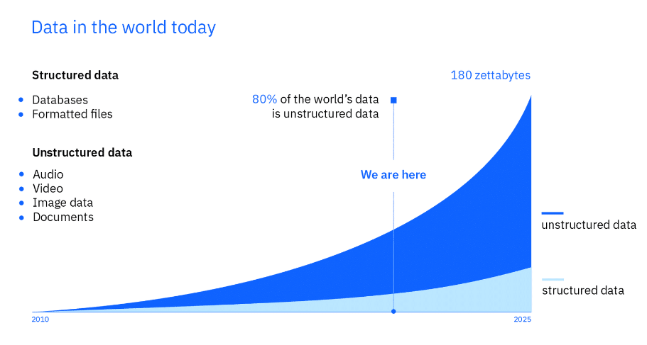

# Dados 🎲

**Assista ao vídeo:**

📌 Dados estruturados são informações que podem ser dispostas em linhas e colunas. Se você puder organizar informações dentro de dados em grupos, com base em características específicas, então esses grupos são dados estruturados.

📌 Dados não estruturados são os dados que não obedecem a uma organização, podendo ser arquivos de áudio, de postagens de mídia social, ou textos , etc.

📌 Dados quantitativos estão relacionados a números. Também é chamado de dado numérico.

📌 Dados qualitativos referem-se a palavras e descrições. Também é chamado de dados categóricos.

📌 Leitura da página [Our World in Data] (https://ourworldindata.org/)

📌 Leitura da [PEP 249](https://peps.python.org/pep-0249/) 

[Documentação Pandas](https://pandas.pydata.org/docs/)

### Para instalar o pandas no VScode: pip install pandas

[Documentação SQLAlchemy](https://docs.sqlalchemy.org/en/20/)

### Para instalar o SQLAlchemy no VScode: pip install SQLAlchemy

[Meu instagram](https://www.instagram.com/p/C926QvbJiIfOnnqks2guRgMZH6GHdeJy641N-E0/)

 IBM - crescimento exponencial de dados:
