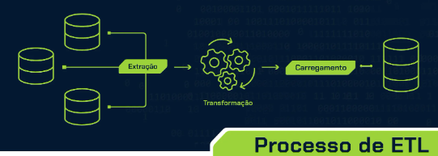
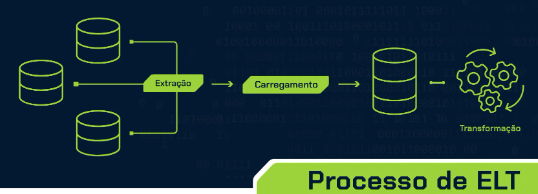
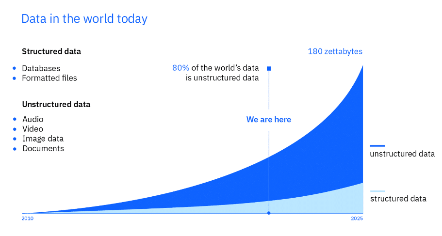
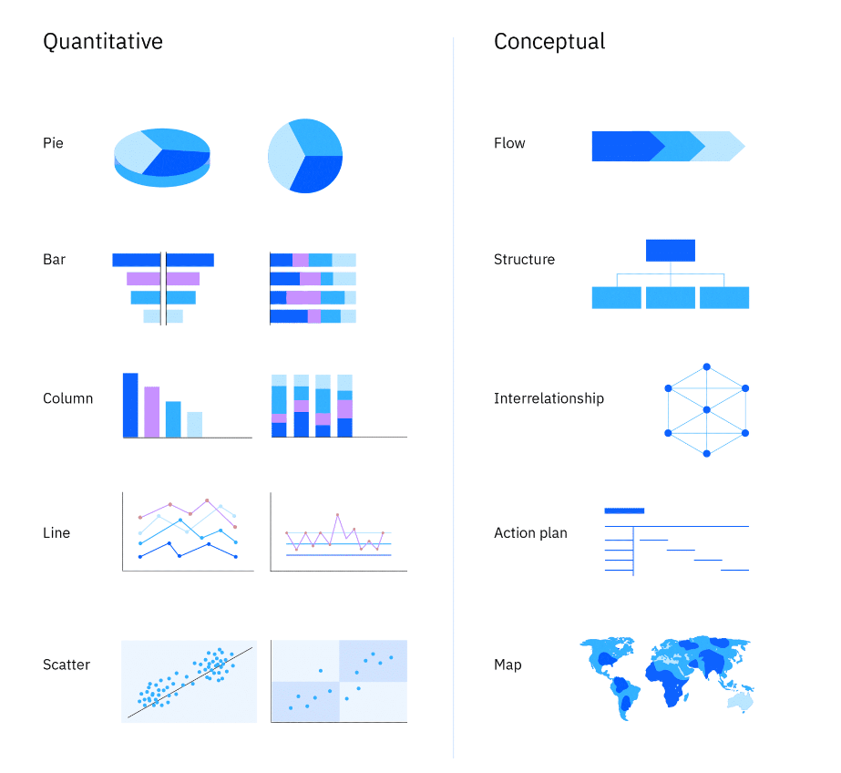
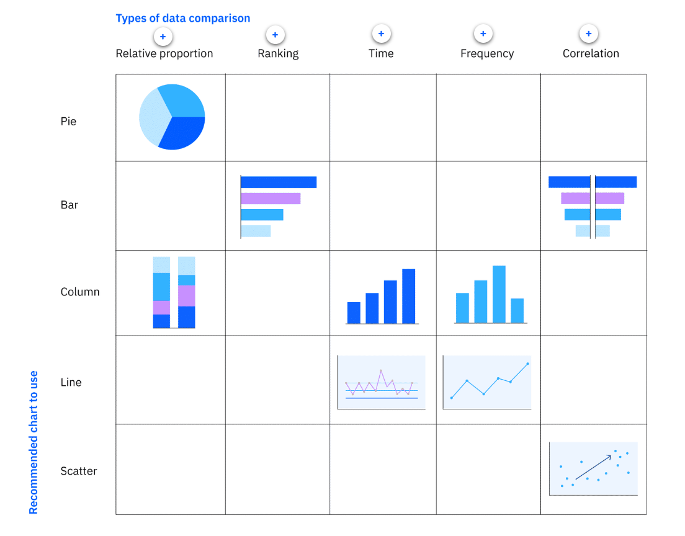
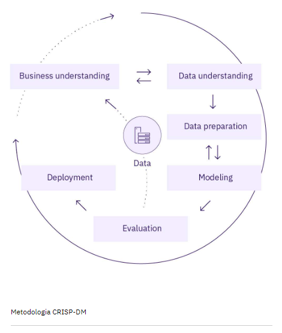
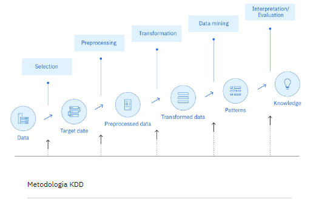
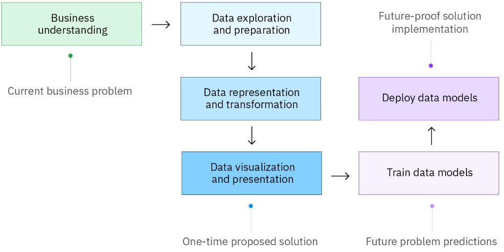

# Dados 🎲

*Acumular grandes volumes de dados não é equivalente a reunir conhecimento valioso. Somente quando os dados são classificados e avaliados que aprendemos algo com eles.*

**Em breve:**

📌 Dados estruturados são informações que podem ser dispostas em linhas e colunas. Se você puder organizar informações dentro de dados em grupos, com base em características específicas, então esses grupos são dados estruturados.

📌 Dados não estruturados são os dados que não obedecem a uma organização, podendo ser arquivos de áudio, de postagens de mídia social, ou textos , etc.

📌 Dados quantitativos estão relacionados a números. Também é chamado de dado numérico. Dados quantitativos podem ser discretos, contínuos ou razão. Por exemplo, o número de pessoas em um cinema são dados discretos porque você só pode contar indivíduos inteiros. Você não pode contar 1,7 pessoas. Dados contínuos podem ser divididos em níveis mais finos e assumir qualquer valor, dados contínuos podem ser divididos em muitas casas decimais. Os dados razão representam comparação de valores, tipo diferença ou uma igualdade, por exemplo quando se fala em proporção, em que estamos falando da igualdade entre duas ou mais razões provenientes das medidas extraídas de grandezas.  Podemos ainda exemplificar dados razão quando se fala da distância entre dois objetos e, o mais importante: dados razão podem ser discretos ou contínuos. 

📌 Dados qualitativos referem-se a palavras, descrições, qualidade. Também são chamados de dados categóricos, sendo seus atributos (binário 'sim ou não' 'exite ou não existe' , nominal que é informação de qualidade 'estado civil' e  ordinal 'nível de escolaridade'). explicando mais dados qualitativos nominais ou ordinais: Dados nominais rotulam variáveis e podem ser agrupados em categorias, mas não têm uma ordem ou hierarquia significativa. Ordinal se refere à ordem das variáveis. Dados ordinais são colocados em uma ordem por sua posição em uma escala.

## Pipeline de dados (fonte Alura)

Um pipeline de dados é uma sequência de etapas interconectadas que permitem a coleta, armazenamento, transformação, análise e visualização de dados, com a intenção de facilitar o fluxo contínuo e automatizado de informações, desde a sua origem até o destino final, a fim de obter insights valiosos e tomar decisões informadas.

O principal objetivo de um pipeline de dados é fornecer uma estrutura eficiente e confiável para lidar com grandes volumes de dados, garantindo sua integridade, segurança e acessibilidade. Mas, independente da ordem do fluxo que escolhemos, um pipeline de dados conta com alguns componentes principais como fontes de dados, transformações e destinos.

O pipeline de dados segue várias etapas essenciais desde a obtenção dos dados brutos até a disponibilização de insights e resultados. Duas abordagens comuns para esse fluxo são o ETL (Extract, Transform, Load) e o ELT (Extract, Load, Transform).

## ETL (fonte IBM)

ETL (que significa extrair, transformar, carregar) é um processo de integração de dados que combina, limpa e organiza dados de várias fontes em um único conjunto de dados consistente para armazenamento em um data warehouse , data lake ou outro sistema de destino.

ETL:

 ELT:

## Data analytics e data science (fonte IBM)

📌 Analistas de dados coletam e examinam grandes conjuntos de dados para identificar tendências, previsões e visualizações de dados para contar uma história convincente por meio de insights acionáveis. Esses insights ajudam as empresas a tomar decisões informadas sobre as necessidades comerciais.

📌 Cientistas de dados  projetam e criam novos processos para modelagem de dados. Eles usam algoritmos, análises preditivas e análises estatísticas. Cientistas de dados têm habilidades técnicas para organizar dados não estruturados e construir suas próprias metodologias para fazer previsões com base em tendências de dados.

## Ferramentas e leituras:

📌 Leitura da página [Our World in Data] (https://ourworldindata.org/)

📌 Leitura da [PEP 249](https://peps.python.org/pep-0249/) 

[Documentação Pandas](https://pandas.pydata.org/docs/)

### Para instalar o pandas no VScode: pip install pandas

[Documentação SQLAlchemy](https://docs.sqlalchemy.org/en/20/)

### Para instalar o SQLAlchemy no VScode: pip install SQLAlchemy

 IBM - crescimento exponencial de dados:

Gartner:
Big data são ativos de informação de alto volume, alta velocidade e/ou alta variedade que exigem formas inovadoras e econômicas de processamento de informações que permitam melhor percepção, tomada de decisões e automação de processos.

## Análise de dados (Coursera - Google Data Analytics)

📌 Fazer perguntas e definir o problema.

📌 Preparar os dados, coletando e armazenando as informações.

📌 Processar os dados, limpando e verificando as informações.

📌 Analisar os dados para encontrar padrões, relações e tendências.

📌 Compartilhar dados com seu público.

📌 Agir com base nos dados e usar os resultados da análise.

Cada tipo de análise de dados tem um objetivo diferente:

📌 Análise descritiva responde à pergunta: “O que está acontecendo?”

📌 Análise diagnóstica responde "Por que tendências e padrões estão acontecendo?"

📌 Análise preditiva usa dados históricos para fazer previsões sobre o futuro.

📌 Análise prescritiva combina os insights de todas as análises de dados anteriores para determinar quais ações tomar para eliminar um problema futuro.

Analistas de dados usam gráficos específicos para visualizar dados quantitativos e qualitativos. 

 IBM - gráficos para tipos de dados:

### pontos plotados

[Khan Academy](https://pt.khanacademy.org/math/basic-geo/basic-geo-coord-plane/x7fa91416:coordinate-plane-word-problems/v/interpreting-plotted-points)

## Narrativa de dados (fonte IBM)

A narrativa de dados envolve uma combinação de dados , visualizações e narrativas .

📌 Quando a narrativa é associada a dados, ela explica ao público o que está acontecendo nos dados e por que um insight é importante.

📌 Quando visualizações são aplicadas a dados, elas esclarecem um público com insights que eles não obteriam sem gráficos ou tabelas. Padrões e tendências emergem de todas as linhas e colunas em um banco de dados, com a ajuda de visualizações de dados.

📌 Quando a narrativa e as visualizações se unem, elas podem criar uma história de dados que pode influenciar, impulsionar mudanças e envolver o público.

## Metodologias para dados estruturados (fonte IBM)

*CRISP-DM, KDD e SEMMA são metodologias clássicas e amplamente adotadas para mineração de dados e são mais adequadas para dados estruturados, são úteis para usar análises descritivas e preditivas. As três metodologias são todas iterativas! Isso significa que as fases ou etapas podem ser repetidas. O conhecimento adquirido pode ser reciclado de volta ao processo para obter mais ou diferentes insights.*

 📌 IBM - CRISP-DM:
 O CRISP-DM é iterativo , o que significa que as fases podem ser repetidas para melhorar incrementalmente o resultado. Os resultados de alguns estágios podem exigir que o ciclo do projeto retorne aos estágios anteriores.

 📌 IBM - KDD:
 KDD é iterativo , o que significa que novos dados podem ser integrados e transformados para obter resultados diferentes e mais apropriados. Observação sobre KDD: o processo não aborda muitas das realidades modernas dos projetos de ciência de dados, como a configuração da arquitetura de big data, considerações de ética ou as várias funções em uma equipe de ciência de dados.

 📌 IBM - SEMMA:
 O Instituto SAS desenvolveu o SEMMA como um processo de mineração de dados. O SEMMA foca principalmente nas tarefas de modelagem de projetos de mineração de dados. SEMMA também é um processo iterativo  , no qual responder a um conjunto de perguntas geralmente leva a perguntas mais interessantes e específicas.

Fonte Instituto SAS: O SAS Institute define mineração de dados como o processo de Amostragem, Exploração, Modificação, Modelagem e Avaliação (SEMMA) de grandes quantidades de dados para descobrir padrões previamente desconhecidos que podem ser utilizados como uma vantagem comercial. 

📌 Sample | Amostra: As amostras devem ser grandes o suficiente para conter as informações significativas, mas pequenas o suficiente para serem processadas.

📌 Explore | Explorar: identifique relacionamentos previstos, tendências não previstas e anomalias para obter entendimento e ideias.

📌 Modify | Modificar: crie, selecione e transforme as variáveis ​​para focar o processo de seleção do modelo.

📌 Model | Modelar: use ferramentas analíticas para procurar uma combinação de dados que preveja de forma confiável um resultado desejado.

📌 Assess | Avaliar: avalie a utilidade e a confiabilidade das descobertas do processo de mineração de dados.

 ## METODOLOGIA IBM:

 -----> entender o problema comercial atual e o público alvo.
- Compreensão empresarial  

 -----> reúne, transforma e atualiza os dados, utiliza análise descritiva e diagnóstica buscando como resultado uma solução proposta.
- Exploração e preparação de dados  
- Representação e transformação de dados  
- Visualização e apresentação de dados

 -----> treinamento e implantação de modelo de dados e uso de IA para prever ou classificar os insights obtidos, antecipar problemas futuros utilizando análise preditiva e prescritiva.
- Treinar modelos de dados
- Implantar modelos de dados

### *exploração inicial de dados*

- Quais características de dados parecem promissoras para análises posteriores?
- A exploração revelou novas características sobre os dados?
- A exploração mudou a hipótese inicial?

### *preparação de dados*

Cientistas de dados não podem presumir que os dados estão prontos para uso, mesmo que sejam dados estruturados. Dados do mundo real geralmente precisam de algum trabalho porque podem ser: 

- Incompleto ou com valores incorretos 
- Corrompido com linhas quebradas ou campos no lugar errado 
- Muito aleatório
- Irrelevante 
- Um outlier, que é um valor que está muito distante de outros valores e distorce os dados
- Um valor ausente em alguns campos

📌 SQL é a linguagem mais comum para extrair, organizar e gerenciar dados em um banco de dados relacional para então executar várias operações nos dados. 

📌 Um arquivo de valores separados por vírgula (CSV)  permite que os dados sejam salvos em um formato tabular. Cada linha do arquivo é um registro de dados.

### *representação e transformação de dados*

- Compreendendo os dados 
- Avaliação da qualidade dos dados
- Descobrindo insights iniciais sobre os dados

### *Estatística descritiva*

 A estatística descritiva resume *quantitativamente* um conjunto de dados. Ela pode responder à pergunta: *"O que está acontecendo?"* Cientistas de dados podem construir uma tabela para descrever um conjunto de dados grande e complexo e fazer observações rápidas sobre:

- Número (N): Qual é o número total de observações?
- Média: Qual é a média de um conjunto de dois ou mais números?
- Mediana: Qual é o número do meio ou “centro” em uma lista ordenada de números? 
- Moda: Qual é o valor mais observado em um conjunto de dados?
- Mínimo: Qual é o extremo mínimo de um conjunto de dados?
- Máximo: Qual é o extremo máximo de um conjunto de dados?
- Desvio padrão: Quão dispersos estão os dados em relação à média?

### *Visualizações exploratórias*

Às vezes, as estatísticas podem ser enganosas quando usadas por si só, então é importante ter outras técnicas. Cientistas de dados também usam visualizações exploratórias . Visualizações exploratórias ajudam a tornar dados complexos mais acessíveis e reveladores. Cientistas de dados usam visualizações iniciais, como tabelas, gráficos e mapas, para descobrir distribuições, encontrar padrões e entender tendências.

Estatísticas descritivas, técnicas de visualização e muitas outras técnicas ajudam os cientistas de dados a entender os dados e avaliar sua qualidade . As equipes de ciência de dados devem validar a qualidade dos dados que usam como entrada para modelagem preditiva porque dados de baixa qualidade levarão a um desempenho ruim do modelo mais tarde no processo.

## Mineração de dados (fonte Estácio)

📌 A mineração é o processo de extração dos dados de uma base, esse processo tem procedimentos como: extrair os dados da base de dados, utilizar ferramentas que vão tratar e transformar esses dados em informações e através dessas informações será possível passar o conhecimento que é o objetivo do processo de mineração. 

📌 Modelo : Com as variáveis ​​refinadas e os dados limpos, a etapa de modelagem aplica uma variedade de técnicas de mineração de dados para produzir um modelo projetado de como esses dados alcançam o resultado final desejado do processo,  é quando os dados coletados, selecionados e refinados são reunidos e testados objetivando chegar ao conhecimento derivado e ilustrá-lo mais visualmente.

## Machine learning:

Aprendizado de máquina (ML) é um ramo da inteligência artificial (IA)  e da ciência da computação que se concentra no uso de dados e algoritmos para permitir que a IA imite a maneira como os humanos aprendem, melhorando gradualmente sua precisão.

Um algoritmo de aprendizado de máquina "ingere" dados para que possa melhorar sua precisão.

*Aprendizado supervisionado*
O aprendizado supervisionado treina máquinas em dados para construir regras gerais que podem ser aplicadas a problemas futuros. Quanto melhor o conjunto de dados de treinamento, melhor a saída.
As informações podem, por exemplo, ser desenhos e fotos de animais, alguns dos quais são cães e são rotulados como “cão”. A máquina tenta identificar padrões para que, quando vir uma nova foto de um cão e for perguntada, “O que é isso?”, ela possa responder, “cão”, com alta precisão.

*Aprendizado não supervisionado*
O aprendizado não supervisionado treina máquinas em um grande volume de dados não rotulados. Por exemplo, uma máquina pode receber muitas fotos e artigos sobre cães. A máquina ingere e classifica as informações dentro de todas as fotos e artigos. Quando é mostrada à máquina uma nova foto de um cão, a máquina pretende ser capaz de identificá-la como um cão, com precisão razoável.

*Aprendizado por reforço*
O aprendizado por reforço não envolve um objetivo específico, é uma técnica de aprendizado de máquina baseada em feedback. Envolve aprender por tentativa e erro ou “aprender conforme você avança”. O aprendizado por reforço é amplamente usado em carros autônomos, drones e outras aplicações robóticas. 

Segundo a fonte *UC Berkeley School of Information* o algoritmo típico de aprendizado de máquina supervisionado consiste em aproximadamente três componentes:

1 - Um processo de decisão:  uma receita de cálculos ou outras etapas que recebe os dados e “adivinham” que tipo de padrão seu algoritmo está procurando encontrar.

2 - Uma função de erro:  Um método de medir o quão boa foi a suposição comparando-a com exemplos conhecidos (quando eles estão disponíveis). O processo de decisão acertou? Se não, como você quantifica “quão ruim” foi a falha?

3 - Um processo de atualização ou otimização:  um método no qual o algoritmo analisa o erro e então atualiza como o processo de decisão chega à decisão final, para que na próxima vez o erro não seja tão grande.

Tipos de aprendizado de máquina segundo a nvidia.com:

1 - Aprendizado supervisionado:  o conjunto de dados usado foi pré-rotulado e classificado pelos usuários para permitir que o algoritmo veja quão preciso é seu desempenho.

2 - Aprendizado não supervisionado:  o conjunto de dados brutos usado não é rotulado e um algoritmo identifica padrões e relacionamentos dentro dos dados sem ajuda dos usuários.

3 - Aprendizado semissupervisionado:  O conjunto de dados contém dados estruturados e não estruturados, que guiam o algoritmo em seu caminho para tirar conclusões independentes. A combinação dos dois tipos de dados em um conjunto de dados de treinamento permite que algoritmos de aprendizado de máquina aprendam a rotular dados não rotulados.

4 - Aprendizado por reforço:  O conjunto de dados usa um sistema de “recompensas/punições”, oferecendo feedback ao algoritmo para aprender com suas próprias experiências por tentativa e erro.

*Dependendo do problema em questão, o modelo de aprendizado não supervisionado pode organizar os dados de diferentes maneiras:*

- Clustering : Sem ser um ornitólogo especialista, é possível olhar para uma coleção de fotos de pássaros e separá-las aproximadamente por espécie, confiando em dicas como cor da pena, tamanho ou formato do bico. É assim que a aplicação mais comum para aprendizado não supervisionado, clustering, funciona: o modelo de aprendizado profundo procura dados de treinamento que sejam semelhantes entre si e os agrupa.

- Detecção de anomalias : Os bancos detectam transações fraudulentas procurando padrões incomuns no comportamento de compra do cliente. Por exemplo, se o mesmo cartão de crédito for usado na Califórnia e na Dinamarca no mesmo dia, isso é motivo para suspeita. Da mesma forma, o aprendizado não supervisionado pode ser usado para sinalizar outliers em um conjunto de dados.

- Associação : Encha um carrinho de compras on-line com fraldas, compota de maçã e copos com canudinho e o site pode recomendar que você adicione um babador e um monitor de bebê ao seu pedido. Este é um exemplo de associação, onde certos recursos de uma amostra de dados se correlacionam com outros recursos. Ao observar alguns atributos-chave de um ponto de dados, um modelo de aprendizado não supervisionado pode prever os outros atributos aos quais eles são comumente associados.

- Autoencoders : Autoencoders pegam dados de entrada, compactam em um código e tentam recriar os dados de entrada a partir desse código resumido. Embora seja um truque de aprendizado profundo, há menos casos reais em que um autocodificador simples é útil. Mas adicione uma camada de complexidade e as possibilidades se multiplicam: ao usar versões com ruído e limpas de uma imagem durante o treinamento, os autoencoders podem remover ruído de dados visuais como imagens, vídeos ou exames médicos para melhorar a qualidade da imagem.

📌 IBM [ML e IA](https://www.ibm.com/topics/machine-learning) 

📌 KDnuggets [Conceitos importantes](https://www.kdnuggets.com/2016/05/machine-learning-key-terms-explained.html) 
